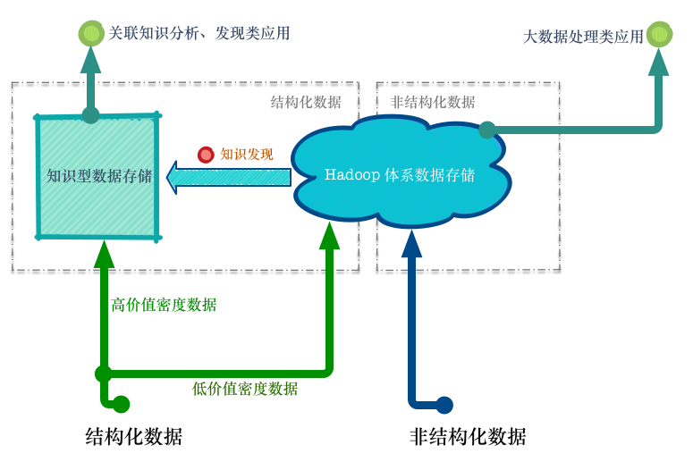
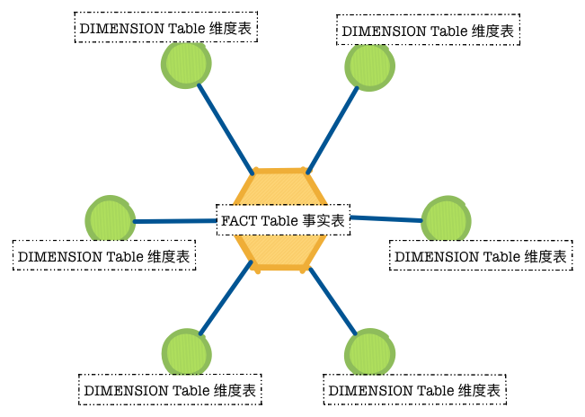
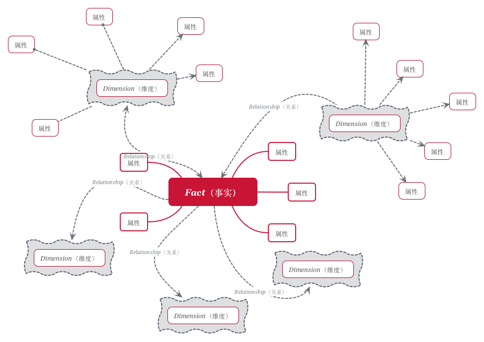
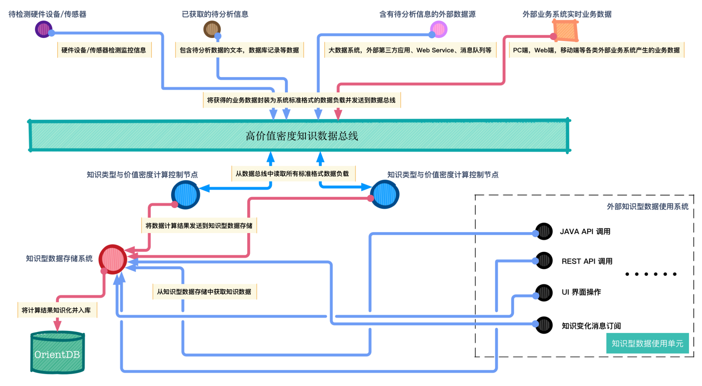

## Info Discover 高价值密度知识分析系统概述

### 系统业务功能
**Info Discover 高价值密度知识分析系统是一套使用大数据技术的知识发现与分析平台。它通过使用特定的IT技术，从传统的大数据平台中获取具有强业务含义的信息（高价值密度知识）并将它们存储在特殊的知识型数据存储系统中供后续的知识分析与检索使用。**在使用中，可以直接将结构化数据中的高价值密度数据以知识型数据的形式存储入库，同时可以通过知识发现技术从大数据系统中获得更多的知识型数据。

Info Discover 分析系统知识信息来源图：

大数据系统的真正价值不是大数据中的数据集合本身，而是这些海量的数据集合中的高价值密度数据（有价值的知识）。而获取高价值密度数据的过程（知识挖掘）有相当的技术和现实方面的挑战。由此我们可以发现以下几个问题：

1. 使用知识发现来发现知识型数据（高价值密度数据），需要付出一定的技术代价。但知识发现的效果并不一定能超过人类意识的主观判断，大多数的数据挖掘和机器学习算法只是在大规模的数据集合上执行可以量化统计的数学计算，对于与人类主观判断相关的分类（例如判断艺术作品或建筑的风格）并没有良好的效果。

2. 一项数据的价值密度高低与否不是一个客观的绝对量值，而是主观的因人而异的评价值（例如，一个建筑的外立面效果图对于建筑设计师来说是高价值密度数据，而对于结构工程师来说可能是低价值密度数据）。

3. 很多结构化数据在特定的业务领域中天然具有较高的价值密度（例如某地区的人口统计数据对于该城市的总人口统计来说天然就是高价值密度数据），无需通过大数据体系进行知识挖掘。

4. 在相当多的领域中，高价值密度数据不是标量的客观数值本身，而是可以由这些数值本身分析发现的一些与外部世界的相互关联。

Info Discover系统的主要目标是**为用户提供高价值密度的知识数据**，它能够对各种异构数据源中的数据进行集中分析计算并将分析结果知识化（应用图形理论存储实体之间的关系信息，使用`维度`、`事实`和`关系`等概念以分解关联标签的形式将分析计算的结果泛化成为图形数据库中的节点并与业务相关的其他节点相互关联）。各种类型的外部知识型数据使用系统可以处理大量复杂、互连接、低结构化的知识型数据记录，从而获取到使用关系型数据库无法获取到（查询复杂、缓慢、超出预期）的业务领域高价值密度知识.该系统还具有以下特性:

**可调整型** - 用户可以通过自身的主观判断来调整、修改知识数据的属性，或者细化知识数据的分类。经过调整后，针对该用户的操作，该知识数据的价值密度也应当相应变化。

**自适应性** - 可以针对不同使用者的主观判断来定义什么是高价值密度数据。对于不同的用户的主观操作，同一条知识数据应该具有不同的价值密度（例如在使用中，作为知识型数据，一个建筑的外立面效果图对于建筑设计师和结构工程师应该具有不同的价值）。

**高可用维度性** - 用户可以从自身主观意愿出发，从任意的维度（此处的维度是指用户看待问题的角度，或者知识数据的某些属性）以单独或者关联的方式来查询知识型数据，从而最大可能性的发掘出知识的价值。

**自主判断性** - 可以针对用户的历史操作记录推断出用户使用系统的意图以及倾向性，从而以推荐的方式自动的帮助用户获取到相关联或者相似的知识数据。

### 系统核心数据模型

知识型数据存储系统的主要目标是为用户提供高价值密度的知识数据，而知识数据价值密度的高低取决于不同用户的主观需求，并不是一个客观的确定数值。为了获取所需的知识数据，用户必须输入若干约束条件做为筛选知识的依据。**用户能够设定的约束条件组合形式越灵活多变，知识型数据存储系统的准确性就越高。通过指定的知识数据获取相关联的其他知识数据（高价值密度数据）的能力越强，知识型数据存储系统的效率就越高，而这一点正是图形数据模型所擅长的(多节点，多重路径的关联计算)。** 但另一方面，存储在系统中的知识数据本身是一些标量数据的组合，实质上是一些客观存在的事实。由于知识数据集合本身是客观数值，同时又是所有的用户共享的，这意味着用来筛选知识数据的约束条件也应该是一个可描述的，有限范围内的度量的集合。为了逻辑性、系统性的在图形数据模型中实现这一特点，我们可以借鉴`传统数据仓库`(基于关系数据库存储原理的数据仓库系统) 技术中 `星型模型`这一概念。以下是传统数据仓库中和星型模型相关的几个概念的简要定义：

■ ***事实（Fact）*** - 事实是数据仓库中的信息单元，也是多维空间中的一个单元，受分析单元的限制。事实存储于一张表中（当使用关系数据库时）或者是多维数据库中的一个单元。每个事实包括关于事实（例如收入、价值、满意记录等）的基本信息，并且与维度相关。

■ ***维度（Dimension）*** - 维度是绑定由坐标系定义的空间的坐标系的轴线。数据仓库中的坐标系定义了数据单元，其中包含事实。坐标系的一个例子就是带有 x 维度和 y 维度的 Cartesian（笛卡尔）坐标系。在数据仓库中，时间总是维度之一，此外具有业务含义的描述性信息也是定义维度的主要属性。

■ ***星型模型（Star Schema）*** - 星型模型是一种使用关系数据库实现多维分析空间的模式。它是传统数据仓库领域中一种主要的多维分析的建模方式。星型模型是一种多维的数据关系，由一个事实表（Fact Table）和一组维表（Dimension Table）组成。每个维表都有一个维作为主键，所有这些维的主键组合成事实表的主键。事实表的非主键属性称为事实（Fact），它们一般都是数值或其他可以进行计算的数据；而维大都是文字、时间等类型的数据，按这种方式组织好数据就可以按照不同的维（事实表主键的部分或全部）来对这些事实数据进行聚集计算（例如求和、求平均、计数，百分比等）。这样就可以从不同的角度数字来分析业务主题的情况。

上图是一个星型模型的结构概念图示，由此图我们可以发现，在宏观上星型模型内部的组成部分实质上具有图形的特点，只是在具体的数据查询和获取操作中传统数据仓库的星型模型使用了关系模型。由此启发，我们可以使用图形数据模型来设计一个"改良版"的的基于图形数据库的星型模型来服务于知识型数据存储系统的需要。以下是该模型的主要技术特征：

1. 设计逻辑层面使用***`事实（Fact）`***来代表知识型数据存储系统中的***`知识数据`***这一概念。

2. 设计逻辑层面使用***`维度（Dimension）`***来代表知识型数据存储系统中用来筛选知识数据的***`约束条件`***这一概念。

3. 系统实现层面使用图论模型中的`节点`来实现事实,***`事实节点`***用来标识在知识数据中客观存在的标量数值，这些数值以属性的形式存储在事实节点中。

4. 系统实现层面使用图论模型中的`节点`来实现维度，***`维度节点`***用来标识用户在获取高价值密度知识数据时所使用的约束条件。维度节点的属性中只储存与使用约束条件相关的数据和信息，不储存任何与知识数据相关的数据和信息。

5. 系统实现层面使用图论模型中的`边`来描述事实与维度间的***`关系`***。通过在边上设置方向（有向边）和不同的属性，可以简洁的使用图论算法筛选出 ***`事实节点`*** 与***`维度节点`***之间的复杂关联关系。

6. 用户可以通过对特定的***`维度节点`*** 执行关联发现操作（图论算法中的多节点，多重路径的关联计算）来获取所需的高价值密度知识数据（图论算法优先获取到的***`事实节点`***代表了高价值密度的知识数据）。

7. 用户使用中可以通过对 ***`事实节点`***的属性值进行检索的方式来筛选出需要的知识数据（类似传统的关系数据库中的数据查询）。

8. 当获取到特定的***`事实节点`***后，用户可以根据自身的主观判断来调整、优化与其相关的***`维度节点`***。从而提高知识数据在特定约束条件下的价值密度的准确性。

9. 通过分析用户对`维度节点`和维度-事实间的`关系`的使用情况，可以推测出用户对使用系统的意图以及倾向性，从而为后续的数据推荐等操作提供数据和技术支撑。

下图以一个***`事实节点`***为中心演示了基于图形数据库的星型模型的概念：

使用上述的基于图形数据库的星型模型来设计实现的知识型数据存储系统具有如下的优点：

■ **通过使用基于图形数据库的实现方式，可以消除关系模型在大规模数据集合和复杂数据类型及关联关系的应用场景下所无法解决的实现复杂性以及性能不足的问题。为在大数据环境下获取高价值密度知识数据提供可靠的技术保障。**

■ **基于图数据模型的特点以及图论算法的支持，对多维度条件下的关联信息查找和发现（获取高价值密度知识数据的过程）提供了比传统关系模型更加强大的功能支持以及更加快捷的性能支持。**

■ **通过借鉴已经久经实践验证的数据仓库领域的概念和设计理念，降低了系统设计的理论和实践风险。同时使用了行业熟悉的术语和操作方式来获取高价值密度知识数据数据，有利于系统在不同业务场景中的推广和应用。**

## Info Discover 高价值密度知识分析系统架构设计概述

### 系统知识获取数据平台

Info Discover　高价值密度知识获取数据平台是一个运行在大数据环境下，对各种异构数据源中的数据进行集中分析并将分析结果使用`知识型数据存储库`知识化并持久化保存的数据分析体系结构。它是一套异构的基于TCP/IP网络传输协议的信息系统。该系统使用 ***Apache Kafka*** 分布式消息系统作为核心信息传输、交换枢纽。它提供了一套标准化的数据输入方式和封装格式,通过使用标准化的数据封装格式（基于***Apache Avro技术***），实现了与操作系统无关，编程实现无关的数据交换体系。

各种类型的数据源（`数据采集单元`）实时使用这一标准的数据输入方式和封装格式将不同类型和结构的业务数据封装成标准格式的`数据负载`输入到数据平台的 Kafka 数据总线中。为各类不同业务内容服务的数据分析和计算系统（`数据分析单元`）实时监听Kafak消息系统中相关的消息主题，使用统一的技术标准从数据总线中获取标准格式的`数据负载`并根据需要解析负载获取特定业务信息。

当数据分析单元对`数据负载`中的业务信息完成分析计算后，基于***OrientDB***技术实现的知识型数据存储系统可以将分析计算的结果知识化（应用图形理论存储实体之间的关系信息，使用`维度`、`事实`和`关系`等概念以分解关联标签的形式将分析计算的结果泛化成为图形数据库中的节点并与业务相关的其他节点相互关联）。通过使用知识型数据存储系统，各种类型的外部知识型数据使用系统可以处理大量复杂、互连接、低结构化的知识型数据记录，从而获取到使用关系型数据库无法获取到（查询复杂、缓慢、超出预期）的业务领域高价值密度知识。

下图为高价值密度知识获取数据平台的数据处理流程：

** 数据采集单元 **: 运行在各类信息系统硬件环境中的各种类型的为高价值密度知识获取数据平台提供输入数据的数据源称为数据采集单元。数据采集单元通过内置的标准化数据发送代理程序使用标准的数据输入方式和封装格式将不同类型和结构的业务数据封装成标准格式的`数据负载`并输入到数据平台的 Kafka 数据总线中。

**数据分析单元**: 数据分析单元的主要功能是从 Kafka 数据总线中获取数据负载，并将数据负载中的业务数据信息分析、计算以产生最终判断结论，并将该结论发送到知识型数据存储系统中以创建领域知识型数据记录。数据分析单元具有群组通讯功能，每一个数据分析单元原则上都运行在一个单独的计算机硬件环境中。若干个数据分析单元共同构成一个数据分析单元网络集群，该集群内的数据分析单元可以互相识别，当新的数据分析单元启动或旧有数据分析单元关闭时，该集群内的所有其他分析单元都会自动获取相应消息提示信息。数据分析单元分为以下两类节点：

**知识型数据存储系统**:

### 系统知识分析工具集

#### ➜ 系统架构概述

### Welcome to GitHub Pages.
This automatic page generator is the easiest way to create beautiful pages for all of your projects. Author your page content here [using GitHub Flavored Markdown](https://guides.github.com/features/mastering-markdown/), select a template crafted by a designer, and publish. After your page is generated, you can check out the new `gh-pages` branch locally. If you’re using GitHub Desktop, simply sync your repository and you’ll see the new branch.

### Designer Templates
We’ve crafted some handsome templates for you to use. Go ahead and click 'Continue to layouts' to browse through them. You can easily go back to edit your page before publishing. After publishing your page, you can revisit the page generator and switch to another theme. Your Page content will be preserved.

### Creating pages manually
If you prefer to not use the automatic generator, push a branch named `gh-pages` to your repository to create a page manually. In addition to supporting regular HTML content, GitHub Pages support Jekyll, a simple, blog aware static site generator. Jekyll makes it easy to create site-wide headers and footers without having to copy them across every page. It also offers intelligent blog support and other advanced templating features.

### Authors and Contributors
You can @mention a GitHub username to generate a link to their profile. The resulting `<a>` element will link to the contributor’s GitHub Profile. For example: In 2007, Chris Wanstrath (@defunkt), PJ Hyett (@pjhyett), and Tom Preston-Werner (@mojombo) founded GitHub.

### Support or Contact
Having trouble with Pages? Check out our [documentation](https://help.github.com/pages) or [contact support](https://github.com/contact) and we’ll help you sort it out.
