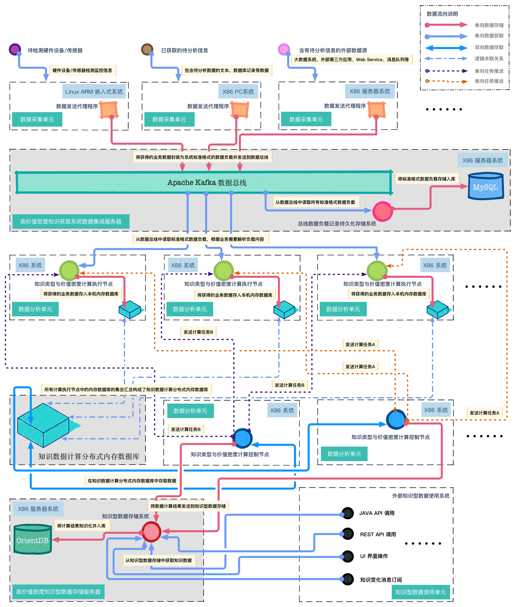

##Info Discover 高价值密度知识分析系统概述
Info Discover 高价值密度知识分析系统是一套使用大数据技术的知识发现与分析平台。它通过使用特定的IT技术，从传统的大数据平台中获取具有强业务含义的信息（高价值密度知识）并将它们存储在特殊的知识型数据存储系统中供后续的知识分析与检索使用。

大数据系统的真正价值不是大数据中的数据集合本身，而是这些海量的数据集合中的高价值密度数据（有价值的知识）。而获取高价值密度数据的过程（知识挖掘）有相当的技术和现实方面的挑战。由此我们可以发现以下几个问题：

1. 使用知识发现来发现知识型数据（高价值密度数据），需要付出一定的技术代价。但知识发现的效果并不一定能超过人类意识的主观判断，大多数的数据挖掘和机器学习算法只是在大规模的数据集合上执行可以量化统计的数学计算，对于与人类主观判断相关的分类（例如判断艺术作品或建筑的风格）并没有良好的效果。
2. 一项数据的价值密度高低与否不是一个客观的绝对量值，而是主观的因人而异的评价值（例如，一个建筑的外立面效果图对于建筑设计师来说是高价值密度数据，而对于结构工程师来说可能是低价值密度数据）。
3. 很多结构化数据在特定的业务领域中天然具有较高的价值密度（例如某地区的人口统计数据对于该城市的总人口统计来说天然就是高价值密度数据），无需通过大数据体系进行知识挖掘。
4. 在相当多的领域中，高价值密度数据不是标量的客观数值本身，而是可以由这些数值本身分析发现的一些与外部世界的相互关联。

Info Discover系统的主要目标是**为用户提供高价值密度的知识数据**，而知识数据价值密度的高低取决于不同用户的主观需求，并不是一个客观的确定数值。为了获取所需的知识数据，用户必须输入若干约束条件做为筛选知识的依据。用户能够设定的约束条件组合形式越灵活多变，知识型数据存储系统的准确性就越高。通过指定的知识数据获取相关联的其他知识数据（高价值密度数据）的能力越强，知识型数据存储系统的效率就越高。另一方面，存储在系统中的知识数据本身是一些标量数据的组合，实质上是一些客观存在的事实。由于知识数据集合本身是客观数值，同时又是所有的用户共享的，这意味着用来筛选知识数据的约束条件也应该是一个可描述的，有限范围内的度量的集合。

### Welcome to GitHub Pages.
This automatic page generator is the easiest way to create beautiful pages for all of your projects. Author your page content here [using GitHub Flavored Markdown](https://guides.github.com/features/mastering-markdown/), select a template crafted by a designer, and publish. After your page is generated, you can check out the new `gh-pages` branch locally. If you’re using GitHub Desktop, simply sync your repository and you’ll see the new branch.

下图为 NeuronGrid 知识发现系统架构框图：  

### Designer Templates
We’ve crafted some handsome templates for you to use. Go ahead and click 'Continue to layouts' to browse through them. You can easily go back to edit your page before publishing. After publishing your page, you can revisit the page generator and switch to another theme. Your Page content will be preserved.

### Creating pages manually
If you prefer to not use the automatic generator, push a branch named `gh-pages` to your repository to create a page manually. In addition to supporting regular HTML content, GitHub Pages support Jekyll, a simple, blog aware static site generator. Jekyll makes it easy to create site-wide headers and footers without having to copy them across every page. It also offers intelligent blog support and other advanced templating features.

### Authors and Contributors
You can @mention a GitHub username to generate a link to their profile. The resulting `<a>` element will link to the contributor’s GitHub Profile. For example: In 2007, Chris Wanstrath (@defunkt), PJ Hyett (@pjhyett), and Tom Preston-Werner (@mojombo) founded GitHub.

### Support or Contact
Having trouble with Pages? Check out our [documentation](https://help.github.com/pages) or [contact support](https://github.com/contact) and we’ll help you sort it out.
